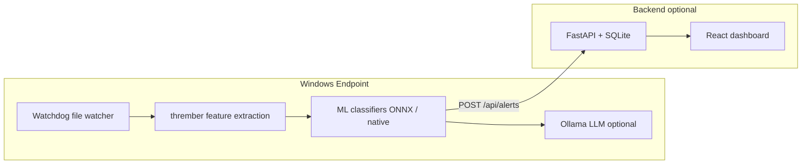

# AGRA — AI-Powered Endpoint Detection & Response

AGRA is a lightweight, local-first EDR prototype for Windows. It watches common download locations, extracts EMBER2024-style features with **thrember**, scores files with ensemble ML models (LightGBM + Random Forest), optionally enriches high-risk hits with a local **Ollama** LLM, posts alerts to a **FastAPI** backend, and displays live results in a **React** dashboard.

The Windows agent runs with a visible console during demos so teammates can see detection, scoring, and blocking in real time. It can also be packaged as `AgraSecurity.exe` via PyInstaller.

---

## Table of Contents

- [Architecture](#architecture)
- [Prerequisites](#prerequisites)
- [Quick Start (Full Stack)](#quick-start-full-stack)
- [Setup](#setup)
- [Intel NPU / ONNX Acceleration](#intel-npu--onnx-acceleration)
- [Running Locally](#running-locally)
- [Configuration](#configuration)
- [Backend API](#backend-api)
- [Testing Detection and Blocking](#testing-detection-and-blocking)
- [Building the Windows Agent EXE](#building-the-windows-agent-exe)
- [Threat Scoring and Runtime Behavior](#threat-scoring-and-runtime-behavior)
- [Project Structure](#project-structure)
- [Model Training](#model-training)
- [Troubleshooting](#troubleshooting)

---

## Architecture



| Component | Role |
|-----------|------|
| **Agent** (`agent/`) | Watches Downloads, Desktop, and `C:\watched_folder`; scores files; deletes threats; system tray |
| **Backend** (`backend/`) | REST API, JWT auth, SQLite alert storage (deployed on Railway or run locally) |
| **Frontend** (`frontend/`) | Live alert feed and stats (polls backend every 3s) |
| **Models** (`model/`) | Trained LightGBM, Random Forest, clustering artifacts; optional ONNX exports |
| **Pipeline** (`pipeline.py`) | All-in-one dev entry: watcher + scorer + LLM + embedded API (no separate backend process) |

**Inference path (agent + pipeline):**

1. Detect new/modified file (debounced, extension-filtered).
2. Check harmless test signatures (AGRA / EICAR).
3. Extract **2568-dimensional** feature vector via thrember.
4. Classify with blended scores: `70% LightGBM + 30% Random Forest`.
5. Cluster with K-Means + HDBSCAN (behavioral context).
6. Optional LLM summary via Ollama.
7. POST alert to backend; **delete file if score ≥ 70**.

---

## Prerequisites

| Requirement | Notes |
|-------------|--------|
| **Windows 10/11** | Primary target; agent uses Windows-specific APIs for tray, login, single-instance lock |
| **Python 3.10+** | Recommended for agent, pipeline, and backend |
| **Node.js 18+** and **npm** | Frontend dashboard |
| **Git** | Clone repo and EMBER2024 submodule |
| **Intel NPU driver** | Optional; required for `Intel NPU` inference mode on Core Ultra AI PCs |
| **Ollama** | Optional; local LLM (`qwen2.5:0.5b` recommended) |

**Linux/macOS:** Feature extraction and `pipeline.py` can be developed on Linux, but the production agent and EXE build are Windows-focused. ONNX falls back to CPU on non-Windows (`onnxruntime` package).

---

## Quick Start (Full Stack)

Run these in **separate terminals** from the repo root after [Setup](#setup).

**Terminal 1 — Backend**

```powershell
.\.venv\Scripts\activate
uvicorn backend.app:app --reload --host 127.0.0.1 --port 8000
```

**Terminal 2 — Agent**

```powershell
.\.venv\Scripts\activate
# Point agent at local backend (see Configuration)
python -m agent.main
```

**Terminal 3 — Frontend**

```powershell
cd frontend
npm install
# Create frontend/.env.local with VITE_BACKEND_URL=http://127.0.0.1:8000
npm run dev
```

Open the Vite URL (usually `http://localhost:5173`), log in, and drop a test file into `C:\watched_folder`.

---

## Setup

### 1. Clone

```powershell
git clone https://github.com/SaiKamalaksha/UncommonHacks-Agra.git
cd UncommonHacks-Agra
git submodule update --init --recursive
```

If `EMBER2024` is missing:

```powershell
git clone https://github.com/FutureComputing4AI/EMBER2024.git
```

### 2. Python virtual environment

```powershell
python -m venv .venv
.\.venv\Scripts\activate
python -m pip install --upgrade pip
pip install -r requirements.txt
```

On **Windows**, `requirements.txt` installs `onnxruntime-openvino` (OpenVINO execution provider for NPU/GPU). On other platforms it installs standard `onnxruntime`.

### 3. Install thrember (EMBER2024)

`thrember` is not on PyPI. Install from the submodule:

```powershell
cd EMBER2024
pip install .
cd ..
```

### 4. ONNX models (recommended for performance)

Accelerated inference requires exported ONNX classifiers:

```powershell
pip install onnxmltools skl2onnx onnx
python model/convert_onnx.py
```

This creates:

- `model/lgbm_classifier.onnx`
- `model/random_forest_classifier.onnx`

If ONNX files are missing, the agent falls back to native LightGBM + sklearn (slower).

### 5. Demo watch folder

```powershell
New-Item -ItemType Directory -Force C:\watched_folder
```

### 6. Ollama (optional)

```powershell
ollama pull qwen2.5:0.5b
ollama serve
```

If Ollama is not running, the agent continues in **ML-only mode**.

---

## Intel NPU / ONNX Acceleration

AGRA uses **ONNX Runtime** with the **OpenVINO execution provider** to prefer hardware acceleration on Intel AI PCs.

Provider order (see `model/onnx_sessions.py`):

1. **Intel NPU** — `OpenVINOExecutionProvider` + `device_type=NPU`
2. **Intel GPU** — `OpenVINOExecutionProvider` + `device_type=GPU`
3. **ONNX CPU** — optimized C++ tree traversal (~much faster than raw sklearn)
4. **Native** — LightGBM + pickled Random Forest if ONNX load fails

On startup you should see one of:

```text
ONNX Runtime loaded — mode: Intel NPU
ONNX Runtime loaded — mode: Intel GPU
ONNX Runtime loaded — mode: ONNX CPU
```

### Windows NPU checklist

1. Install [Intel NPU Driver](https://www.intel.com/content/www/us/en/download/794734/intel-npu-driver-windows.html) (Core Ultra / AI PC).
2. `pip install -r requirements.txt` (pulls `onnxruntime-openvino` on Windows).
3. Ensure ONNX models exist (`python model/convert_onnx.py`).
4. Run agent or pipeline; confirm mode in console output.

**Notes:**

- First NPU compile can take **1–3 minutes**; later runs are faster.
- Tree-ensemble ONNX graphs may fall back to **ONNX CPU** on some OpenVINO builds (dynamic-rank limitation). You still get a large speedup vs native sklearn.
- Disable acceleration: `python pipeline.py --no-npu` (pipeline only). Agent: `Scorer(model_dir, use_npu=False)` in code.

---

## Running Locally

### Backend (FastAPI)

```powershell
.\.venv\Scripts\activate
uvicorn backend.app:app --reload --host 127.0.0.1 --port 8000
```

Backend dependencies (if running from `backend/` only): `pip install -r backend/requirements.txt`

Default test user is created on first startup:

| Field | Value |
|-------|--------|
| Email | `test@agra.com` |
| Password | `agra1234` |

### Agent (recommended for demos)

```powershell
.\.venv\Scripts\activate
python -m agent.main
```

**Watched directories** (defaults in `agent/config.py`):

- `%USERPROFILE%\Downloads`
- `%USERPROFILE%\Desktop`
- `C:\watched_folder`

**Logs:** `agent\AgraSecurity.log` (next to `main.py` when running from source; next to `.exe` when packaged)

**Behavior:** Login window → load ML models → optional Ollama → file watcher + system tray. Parallel scan workers (`max_workers=3`) keep throughput up when LLM calls block.

### Frontend (React + Vite)

```powershell
cd frontend
npm install
npm run dev
```

Create `frontend/.env.local` for local backend:

```env
VITE_BACKEND_URL=http://127.0.0.1:8000
```

Without this file, the dashboard defaults to `http://127.0.0.1:8000`.

### All-in-one pipeline (development)

`pipeline.py` runs the file watcher, ML scorer, optional Ollama LLM, and embedded FastAPI server in one process (SQLite DB at repo root).

```powershell
.\.venv\Scripts\activate
python pipeline.py
python pipeline.py --watch ~/Desktop C:\watched_folder
python pipeline.py --port 8000 --no-llm
python pipeline.py --no-npu
```

Then run the frontend separately and point it at `http://127.0.0.1:8000`.

---

## Configuration

### Agent backend URL

`agent/config.py` defaults to the **Railway production** API:

```text
https://uncommonhacks-agra-production.up.railway.app
```

For **local full-stack** development, change `BACKEND_URL` in `agent/config.py` to:

```python
BACKEND_URL = "http://127.0.0.1:8000"
```

The agent posts alerts to `{BACKEND_URL}/api/alerts`.

### Agent thresholds and extensions

Edit `AgentConfig` in `agent/config.py`:

| Setting | Default | Description |
|---------|---------|-------------|
| `threat_threshold` | `70` | Files at or above this score are **deleted** |
| `warning_threshold` | `40` | Suspicious classification band |
| `max_file_size_mb` | `100` | Skip larger files |
| `scan_extensions` | `.exe`, `.dll`, `.zip`, … | Only these extensions are scanned |
| `use_llm` | `True` | Set `False` for ML-only |
| `ollama_model` | `qwen2.5:0.5b` | Ollama model name |

### Frontend environment

| Variable | Default | Description |
|----------|---------|-------------|
| `VITE_BACKEND_URL` | `http://127.0.0.1:8000` | API base URL for alerts and stats |

---

## Backend API

| Method | Path | Description |
|--------|------|-------------|
| `POST` | `/login` | Email/password → JWT |
| `POST` | `/register` | Create user → JWT |
| `POST` | `/verify-token` | Validate agent/dashboard token |
| `GET` | `/api/alerts?limit=50` | Recent alerts |
| `POST` | `/api/alerts` | Ingest alert from agent |
| `GET` | `/api/stats` | Aggregate scan statistics |

**Production:** Backend is deployed on Railway (`backend/` includes `Procfile`, `nixpacks.toml`). Set `SECRET_KEY` in the hosting environment for production JWT signing.

---

## Testing Detection and Blocking

### AGRA test signature (recommended)

Harmless string baked into the agent; does not trigger Defender:

```powershell
Set-Content C:\watched_folder\agra_visible_test.txt "AGRA-EDR-TEST-MALWARE"
```

Expected output:

```text
[DETECT] New file: C:\watched_folder\agra_visible_test.txt
[SCAN] Scoring agra_visible_test.txt ...
[TEST] AGRA test signature detected.
[RESULT] agra_visible_test.txt: score=100, class=malicious
[BLOCK] STOPPED THREAT - deleted file: C:\watched_folder\agra_visible_test.txt
```

### EICAR

The official EICAR test file is also recognized. **Windows Defender** may quarantine it before AGRA sees it—use the AGRA signature for reliable demos.

### Encrypted ZIPs

Password-protected or encrypted archives are **blocked** (score 100) because contents cannot be inspected.

---

## Building the Windows Agent EXE

PyInstaller spec: `agent/AgraSecurity.spec`

```powershell
.\.venv\Scripts\activate
cd agent
pyinstaller AgraSecurity.spec
```

Output:

```text
agent\dist\AgraSecurity.exe
agent\dist\AgraSecurity.log
```

The spec bundles the `model/` directory and hidden imports for pickled sklearn/HDBSCAN models. Update the `datas=` path in the spec if your repo lives somewhere other than the machine that authored the spec.

**Console:** `console=True` so detections are visible during demos.

**Login:** Falls back to dummy credentials if Tkinter is unavailable.

---

## Threat Scoring and Runtime Behavior

| Score | Classification | Action (agent) |
|-------|----------------|----------------|
| **≥ 70** | Malicious | File deleted after alert is sent |
| **40–69** | Suspicious | Alert only |
| **< 40** | Benign | Alert only |

**Blended score:** `threat_score = int((0.7 × lgbm_prob + 0.3 × rf_prob) × 100)`

**Scanned extensions (default):** `.exe`, `.dll`, `.sys`, `.ps1`, `.bat`, `.xlsm`, `.pdf`, `.elf`, `.apk`, `.com`, `.txt`, `.zip`

**Ignored download temps:** `.crdownload`, `.part`, `.tmp`, `.download`, `.partial`, `.opdownload`

**Debounce:** Same path ignored if rescanned within 5 seconds.

---

## Project Structure

```text
UncommonHacks-Agra/
├── agent/                    Windows EDR agent
│   ├── main.py               Entry point, logging, tray, login
│   ├── agent.py              Watchdog handler, thread pool, delete logic
│   ├── scorer.py             ML scoring, test signatures, ONNX/NPU path
│   ├── alerter.py            POST alerts to backend
│   ├── llm_analyst.py        Ollama integration
│   ├── config.py             Watch dirs, thresholds, backend URL
│   ├── auth.py               Token persistence and verification
│   ├── login_window.py       Tkinter login UI
│   ├── AgraSecurity.spec     PyInstaller config
│   └── ReadMe.md             Agent-specific quick reference
├── backend/                  FastAPI + SQLite
│   ├── app.py                Routes (auth + alerts)
│   ├── database.py           SQLite helpers
│   └── models.py             Pydantic schemas
├── frontend/                 React dashboard (Vite)
│   └── src/Dashboard.jsx     Live alerts, stats, settings UI
├── model/                    Trained artifacts + tooling
│   ├── onnx_sessions.py      NPU/GPU/CPU ONNX loader (shared)
│   ├── convert_onnx.py       Export .model/.pkl → .onnx
│   ├── ember2024_pipeline.py Training pipeline
│   ├── evaluate_models.py    Offline evaluation
│   └── README                Model metrics and training docs
├── EMBER2024/                Submodule — thrember feature extractor
├── pipeline.py               All-in-one dev pipeline
├── requirements.txt          Root Python dependencies
└── README.md                 This file
```

---

## Model Training

Trained classifiers and clusterers live in `model/`. See **`model/README`** for:

- EMBER2024 download and training commands
- Output file descriptions
- Reported AUC / precision / recall on PDF subset

**Runtime artifacts used by the agent:**

| File | Purpose |
|------|---------|
| `lgbm_classifier.model` | LightGBM malicious/benign |
| `random_forest_classifier.pkl` | Random Forest (native fallback) |
| `lgbm_classifier.onnx` / `random_forest_classifier.onnx` | Accelerated inference |
| `kmeans_clusterer.pkl`, `hdbscan_clusterer.pkl` | Clustering |
| `cluster_scaler.pkl`, `cluster_pca.pkl` | Cluster preprocessing |

---

## Troubleshooting

| Symptom | What to try |
|---------|-------------|
| `ONNX Runtime loaded — mode: ONNX CPU` on NPU laptop | Install Intel NPU driver; confirm `onnxruntime-openvino` installed; re-run `convert_onnx.py` |
| `Using native LightGBM + sklearn` | Missing `.onnx` files or import error — run `python model/convert_onnx.py` |
| thrember / feature extraction fails | `cd EMBER2024 && pip install .` from repo root venv |
| Dashboard shows no alerts | Match `VITE_BACKEND_URL` to running backend; check agent `BACKEND_URL` |
| Agent login fails offline | Use dummy login: `test@agra.com` / `agra1234` |
| `[ALERT] Failed to send` | Backend down or wrong URL in `agent/config.py` |
| Ollama never runs | `ollama serve` + `ollama pull qwen2.5:0.5b`; or set `use_llm=False` |
| Another instance running | Only one agent per machine (Windows lock file) |
| PyInstaller model load errors | Ensure `AgraSecurity.spec` `datas` includes full `model/` folder and hiddenimports |

---

## Dummy Test Credentials

```text
email:    test@agra.com
password: agra1234
```

Used by the backend seed user, login window fallback, and local development.
